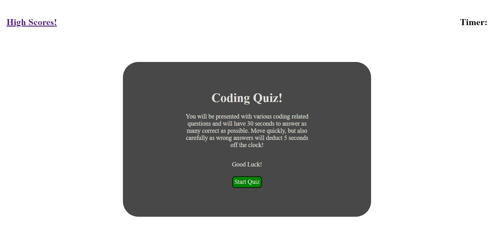
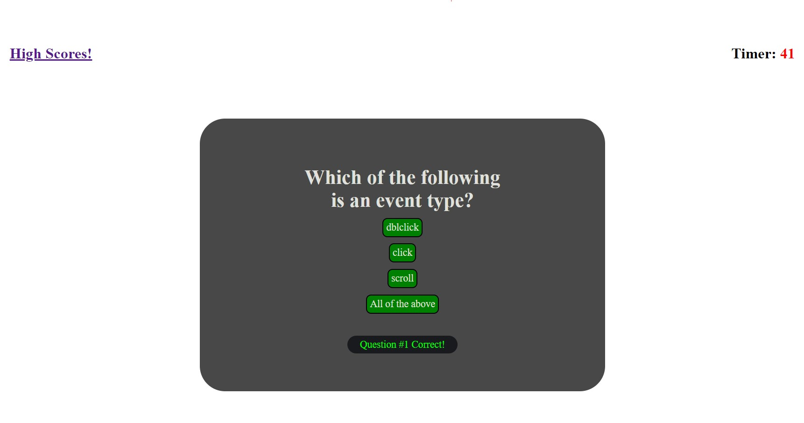
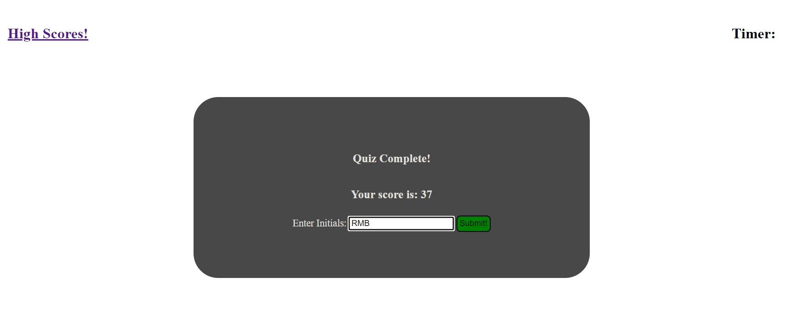

# Coding Quiz

Timed coding quiz featuring dynamically updated HTML and CSS powered by Javascript

---

Created by: Robert Bishop

## Contents:
* [Live Page Link](#live-page-link)
* [Screenshots](#screenshots)
* [Usage](#usage)
* [Skills/Concepts Used](#skillsconcepts-used)
* [Steps Taken](#steps-taken)

---

## Live Page Link:

[https://rbishop85.github.io/code-quiz/](https://rbishop85.github.io/code-quiz/)

---

## Screenshots:

> Intro Page where quiz is started.

> Sample question page, result of previous questions shown at bottom.

> Final page of quiz where score is displayed and user has option of storing their intials along with their score.

> High scores page.

---

## Usage:

- Upon loading the page you there is a brief explanation of the quiz in the center of the page with a start button under it.  There is also a link in the upper left to the high scores page, and a timer in the upper right that is currently blank.
- After hitting the start button the intro area disappears and is replaced by the first question.  A 45 second timer also appears in the upper right and starts counting down.
- When you click on an answer the next question is displayed.  If you click a correct answer you see a message underneath in green stating that you picked the correct answer.  If the answer is wrong then the message is in red stating that your answer was wrong and 10 seconds are deducted from the time automatically.
- After you either answer all questions or run out of time the last question disappears and is replaced by your final score and a text box for you to key your initials into and hit submit to save those intials with your score to the high score page.
- Hitting the submit button not only saves your info but re-directs you to the high scores page where you will see all of your personal high scores ordered from highest to lowest.
- All of these scores are stored in the local memory of the web browser that you are currently using and won't be viewable from any other place.  On this final high scores page you have to buttons.  You can either press "Go Back" to return to the start of the quiz, or press "Clear High Scores" and all of your saved scores will disappear off of the page and from your local browser memory.

---

## Skills/Concepts Used:

* HTML for the basic layout of the page.
* CSS for some simple styling to keep it looking intereasting.
* Javascript to control the actions of the game.
  - Variables, Arrays and Objects to store all the necessary values and questions.
  - Functions to run set tasks.
  - Event Listeners to monitor button events and link to set functions.
  - If statments to ensure functions only run when proper buttons are pressed.
  - Interacting with the DOM to pull info from the webpage and insert content back into it, as well as changing settings for things like making different areas of the page disappear and appear.
  - Timeouts to clear the question completion messages after a brief amount of time.
  - Intervals for running the main timer

---

## Steps Taken:

- [x] Created intial html, css and js pages and linked them together.
- [x] Made basic html layout and setup basic css styling to get elements where I wanted.
- [x] Started setting up variables.
- [x] Setup a basic timer countdown that clears at 0.
- [x] Setup the html/css layout of individual quez questions.
- [x] Setup initial start button function.
- [x] Setup responses to selecting quiz answers.
- [x] Ensured that pages changed and timer was affected based on answers chosen.
- [x] Created sepearate elements for intro, quiz and final score page and set them so that they'd be either hidden or shown depending on what info was supposed to be on the page.
- [x] Made sure that the countdown hitting 0 also ended the game.
- [x] Setup final score page.
- [x] Coded final score page so that upon keying in intials and submitting both the initials and final score would be stored in an object and then inserted into an ongoing array of scores stored in local system memory.
- [x] Refined the coding for the displayed question results so they'd show up properly and clear out after a short amount of time.
- [x] Started working on the separate high scores page.
- [x] Finished up coding of high scores page setting it to automatically sort scores by highest first.
- [x] Tweaked overall page css styling.
- [x] Replaced placeholder questions used for page development with actual questions and answers.
- [x] Created README.

---

## Thoughts/Future Ideas:

This was easily the most challenging project that I've worked on so far.  It had me constantly trying things and then searching for other ways to accomplish what I was attempting to do.  If I were to expand on this the first thing I'd like to do is add more potential questions.  I could see having a difficulty selector to determine the level of questions you see and also randomizing the order that questions are displayed in.  I'd also like to change how it's scored because while I enjoyed the timer and losing time for wrong questions I'd like to see number of correct answers as the primary score weight, maybe with a bonus for time remaining.

---

[Top of Page](#coding-quiz)